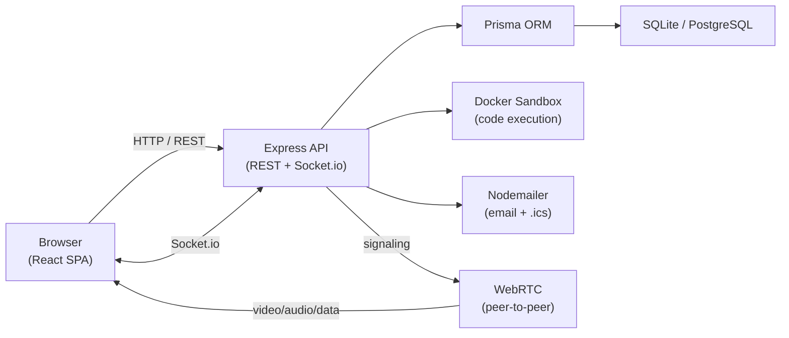

# HR Recruitment Portal


Full-stack HR recruitment platform covering the complete hiring lifecycle — job postings, applications, multi-round interviews, and proctored assessments — with a real-time WebRTC interview room comparable to HackerRank CodePair / CoderPad. Five role types (ADMIN, HR, MANAGER, INTERVIEWER, CANDIDATE) each get a purpose-built interface, backed by a secure JWT + RBAC API and a Docker-sandboxed code execution engine.

## Architecture



## Features

| Feature | Details |
|---------|---------|
| Live interview room | Bidirectional video/audio, screen share, in-call chat, live interviewer notes |
| Collaborative code editor | Monaco (VS Code engine), real-time sync, multi-language output panel |
| Docker code execution | Node.js + Python, no network, 128 MB RAM, 0.5 CPU, PID-limited |
| Vector-stroke whiteboard | Pen, shapes, eraser, undo — JPEG sync on stroke end |
| Code replay | Step through every code run from an interview session chronologically |
| Proctored assessments | Webcam required, fullscreen enforced, tab-switch auto-terminate |
| Structured scorecards | 5-category star ratings, recommendation (Strong Hire → Strong No Hire) |
| Interview event timeline | GitHub-style feed: bookmarks, filters, relative timestamps |
| Server-side session recovery | Code, chat, canvas, and timer restored from DB across devices |
| Email + calendar invites | Nodemailer + ical-generator; .ics attached to interview invites |
| Real-time notifications | Socket.io personal rooms — no polling |
| Audit logging + analytics | Append-only audit log (ADMIN); funnel, round-type, and interviewer stats |

## Tech Stack

| Layer | Technology |
|-------|-----------|
| Backend | Node.js 20, Express.js (ESM), Prisma ORM v5 |
| Database | SQLite (dev) / PostgreSQL (prod) |
| Auth | JWT (8 h expiry), bcryptjs, RBAC middleware |
| Real-time | Socket.io v4 + RTCPeerConnection (WebRTC) |
| Frontend | React 18, TypeScript, Vite 5, Tailwind CSS |
| Code editor | `@monaco-editor/react` |
| Code sandbox | Docker (`--network=none --memory=128m --cpus=0.5`) |
| Email | Nodemailer + ical-generator |
| Testing | Vitest + Supertest (real SQLite DB, no mocks) |

## Quick Start

```bash
git clone <repo-url>
cd portal

# Backend
cd backend && npm install
cp .env.example .env        # fill in JWT_SECRET and SMTP credentials
npm run db:push
npm run db:seed
npm run dev                 # http://localhost:5000

# Frontend (new terminal)
cd frontend && npm install
npm run dev                 # http://localhost:5173
```

> **Docker required** for sandboxed code execution. Pull images once:
> ```bash
> docker pull node:20-alpine && docker pull python:3.11-alpine
> ```
> For local dev without Docker, set `ALLOW_DIRECT_EXECUTION=true` in `backend/.env`.

## Demo Credentials

| Role | Email | Password |
|------|-------|----------|
| Admin | admin@company.com | admin123 |
| Manager | manager@company.com | manager123 |
| HR | hr@company.com | hr123 |
| Interviewer | interviewer@company.com | interviewer123 |

## Running Tests

```bash
cd backend
npm test    # spins up test.db, runs 20 Vitest + Supertest API tests
```

Tests cover auth, RBAC, applications, rounds, and code execution — no mocks, real database.

## Environment Variables

Key variables for `backend/.env` (see `.env.example` for the full list):

| Variable | Description |
|----------|-------------|
| `JWT_SECRET` | Strong random string for signing tokens |
| `DATABASE_URL` | `file:./hr_portal.db` (dev) or PostgreSQL URL (prod) |
| `SMTP_HOST / SMTP_USER / SMTP_PASS` | Gmail or any SMTP provider for interview invite emails |
| `FRONTEND_URL` | Allowed CORS origin (e.g. `http://localhost:5173`) |
| `ALLOW_DIRECT_EXECUTION` | `true` only in local dev when Docker is unavailable |

## Production Deployment

Set `DATABASE_URL` to a PostgreSQL connection string and configure SMTP credentials, then deploy the backend to Railway or Render and the frontend to Vercel or Netlify (set `VITE_API_URL` to your backend domain).
